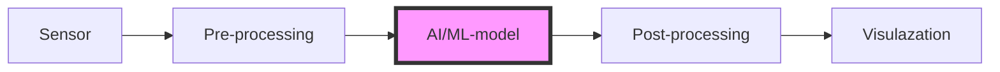

> The OAXS description is currently work in progress. Please join the conversation at [https://oaxs.org](https://oaxs.org).


# The Open AI Accelerator Standard (OAXS)

This repository (and other linked repositories under this account) contain documentation and reference implementations, as well as contributed implementations, of the Open AI Accelerators Standard (OAXS).

## Overview

* [About OAXS](#About-OAXS)
	* [The aims of OAXS](#The-aims-of-OAXS)
	* [The scope of OAXS]()
	* [OAXS High level implementation]()
* [Using OAXS]()
	* [Getting started from c]()
	* [Getting started from python]()
* [OAXS developement]()
	* [Contributing to OAXS]()
	* [The OAXS steering group]()
* [OAXS documentation]()
	* [Toolchain documentation]()
	* [Runtime documentation]()
* [OAXS impelementations](#OAXS-impelementations)
	* [The contributed accelerator repository]() 

	
# About OAXS

OAXS intends to provide a simple to use, easy to expand, *standardized* -- by virtue of reference implmentations and usage tools -- method of adopting specific (edge) AI accelerators into edge AI projects. 

The OAXS standard is designed to make it easy to take a trained AI model and execute it on novel (edge) AI hardware. For AI solution developers the OAXS standard should make it easy to reap the benefits of the new chipsets that are becoming available without having to worry about the target hardware when setting up and testing their initial AI pipeline. 

For those designing and bringing to the market new chipsets (NPUs, FPUs, GPUs, XPUs, etc.) the OAXS standard is aimed to lower the barriers of usage and provide a unified way in which -- if adhered to -- any developer can easily access the advantages or the novel hardware. For our initial introduction to OAXS, please see the [founding white-paper](https://www.networkoptix.com/blog/2024/03/05/introducing-the-open-ai-accelerator-standard).


## The aims of OAXS

For **AI solution developers**, OAXS aims to...

* ...Prodivde a unified way of *converting* a trained AI/Ml model specified in a standardized generic format (we use [ONNX]() as our standard way of expressing a model) to a specific format that run on the supported target hardware.
* ...Provide a unified way of executing the specific model on the target hardware. I.e., OAXS provides a standardized ABI/API to pass input data to an AI/ML model, run inference, and retreive the model out.

Jointly, the above should allow AI solutions developers to easily move between different hardware targets and reap the fruits of new developments in accelerator design that benefit their use case.

For **manufacturers of new (edge) AI hardware**, OAXS aims to ...

* ...Provide a unified way of allowing "access" to their hardware. By adhering to OAXS there is a single point of entry for developers looking to embrace new hardware.
* ...Reduce the need for ones own software ecosystem. By adhering to OAXS highger level software tools and ecosystems can easily incorporate new hardware without the need for the manufacturer of the accelerator to provide all the parts of a full AI/ML pipeline: accelerator manufacturers can simply focus on their hardware and the core software components needed to run an AI model on their hardware.

Note that OAXS is designed for maximum flexbility for the AI hardware manufacturer to adopt the AI model to their preferred format and to -- if desirable -- keep toolchains or other core bits of software that are deemed business valuable proprietary.


## The scope of OAXS

Currently, OAXS focusses on privding a unified method of accelerating (i.e., (partly) moving to an NPU, GPU, FPU, XPU, ..) *AI/ML models*. Models in our context are defined as functions that are specified using [ONNX]() (ONNX is simply the format used to express which computations need to be carried out by the function in which order) which have `n` typed tensors as input, and `m` typed tensors as output. 

OAXS does **not** facilitate using the accelerator for application/vertical specific tasks such as decoding of a video stream or FFT of a vibration sensor; such operations might be performmed well by a specific accelerator but they do not fall into to initial OAXS specification.

The diagram below provides a high level abstraction of a common edge AI pipeline in which sensor data is pre-processed, fed to an AI or ML model for inference, its results are post processed, and that final output is visualized. Within OAXS we assume the pipeline runs on a generic CPU (multiple architectures are supported), whereas the AI model (or inidivual operations withing the AI model) are accelerated by the XPU using the OAXS standard.



## OAXS High level implementation

At a very high level, the OAXS specification is very simple. We assume a (trained) AI model `M` is available in ONNX format. Hence, there is access to a generic, deployment method independent, description of the function that the model implements. From this starting point we postulate that only the following two steps are neccesary to accelerate an AI model (or parts thereoff):

1. "Conversion" of the model generic ONNX model specification to a format that can run on the accelerator. Note that the result might itself be in ONNX formate (for example when operations are accelerated one-by-one by the runtime, see below), or the result might be a totally proprietary binary. The core insight is that there is a "conversion" step neccesary from generic model desciption to a model descirpiton that is specific and can be (party) accelerated using the XPU of interest. For the conversion step the OAXS standard merely provides a unified way of going from ONNX to the target's specification including standardized error handling and formatting. We call the conversion process the **OAXS toolchain.**
2. "Running" the specific model specification, i.e., generating inference. Once a specific model specification is available--after conversion--we simply need a unified way to (from a process running on the CPU) pass data to the model, execute its computation, and return the results. We call this the **OAXS runtime.**

The above are effectively two seperate processes (although, for nuances, see the [OAXS documnentation]() below). The first of the two can run anywhere: the conversion of a generic AI model to the target specific model can be done in the cloud, on your local machine, or using some hosted conversion service. The second process runs on the edge device that runs the pipeline (see diagram above).

Given the availability of a standard -- OAXS -- for sharing both steps with the larger developer community, it is easy for developers to adopt a new accelerator into their AI pipeline: a developer simply runs the conversion process to obtain a specific model implementation, and next "swaps" the runtime of the AI model for the appropriate XPU version.

Please note that for the toolchains we use pre-defined [docker containers](). For the runtimes we allow any format, as long as there is a unified runtime [ABI]() available.


# Using OAXS

Here we provide simple and self contained examples of how to use the OAXS standard to switch from a CPU only implementation of a (simplified) AI pipeline to one in which the model is accelerated using a [Hailo]() Accelerator. For the sake of example, we use a [YoloV5 model in ONNX format]().

Note that in all cases we simply highlight core lines of code for the application; full running examples can be found in our [examples repository]().

## Getting started from `c++`
> The full example can be found [here]().

Using the ONNX runtime, in `c++`, we can execute the YoloV5 model as follows:

``` c

input_data =   ....


```

The above can be converted for use with the Hailo accelerator using our 2 step process:

### 1. Model conversion (CMD)


### 2. Updated pipeline


``` c

input_data =   ....

OAXSRuntime("hailo")
...

```


## Getting started from `python`
> The full example can be found [here]().

Using the ONNX runtime, in `python`, we can execute the YoloV5 model as follows:

```
# load the model
onnx = read.modelFile(file.onnx)

# use ONNX runtime
input.tensor = [[12,10],[56,09]]

ONNXRuntime.load(onnx)
inference = ONNXRuntime.run(input.tesor)
print(inference)
```


### 1. Model conversion (CMD)

Run the conversion:

```
> ls

# Step 1, CMD toolchain to  convert file
> docker run hailo-conv-toolchain-container "file.onnx"

> ls
hailo-file.oaxs
conversion-log.json
error-log.json
message.json
```

Results in a new file, `hailo-file.oaxs` and a meta data triplet (conversion-log, error-log, message.json)


### 2. Updated pipeline


```
# Step 2, Use new runtime (python-like speudo code)

# Data same as previous
input.tensor = [[12,10],[56,09]]

# use Hailo runtime
OAXSRuntime.load(Hailo) # Python helper function to load OAXS runtimes
OAXSRuntime.loadModel('hailo-file.oaxs')

inference = OAXSRuntime(input.tesor)
print(inference)

```

You have simply updated the model file (using the toolchain), and ran the model (using the runtime).


# OAXS development

Specificzation: reference implementations, examples, tests.

## Contributing to OAXS

How can you contribute?

* [Code templates](): Template for the container (empty) and the `c++` function signature for the runtime (empty).
* * [Reference implementation](): The Hailo toolchain container and Hailo runtime.

## The OAXS steering group

Who are heading this initiative? What are the roles?

## Active users

... 

# OAXS documentation

We split our documetnation into four parts (which are partly devided over repositories):

1. Using the OAXS standard in your (edge) AI projects.
2. Creating an OAXS toolchain container.
3. Creating an OAXS runtime.
4. Submitting a new accelerator to the OAXS repository (including mandatory testing and profiling).

## OAXS usage documentation

You find docuemtnation and usage examples [here]().

## Toolchain documentation

You will find documentation, reference implementations, and exmaples for creating toolchains [here]().

## Runtime documentation

You will find documentation, reference implementations, and exmaples for creating runtimes [here]().

## OAXS testing

You find test to evaluate your OAXS implementation before submission [here]().

# OAXS contributed impelementations

We currently support the following toolchains and runtimes...

LIST SUPPORTED...  