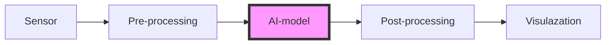

> The OAXS description is currently work in progress. Please join the conversation at [https://oaxs.org](https://oaxs.org).

# The Open AI Accelerator Standard (OAXS)

This repository (and other linked repositories under this account) contain documentation and reference implementations, as well as contributed implementations, of the Open AI Accelerators Standard (OAXS).

## Overview

* [About OAXS](#About-OAXS)
	* [The aims of OAXS](#The-aims-of-OAXS)
	* [The scope of OAXS]()
	* [OAXS High level implementation]()
* [Using OAXS]()
	* [Getting started from c]()
	* [Getting started from python]()
* [OAXS developement]()
	* [Contributing to OAXS]()
	* [The OAXS steering group]()
* [OAXS documentation]()
	* [Toolchain documentation]()
	* [Runtime documentation]()
* [OAXS impelementations](#OAXS-impelementations)
	* [The contributed accelerator repository]() 

	
# About OAXS

OAXS intends to provide a simple to use, easy to expand, *standardized* -- by virtue of reference implmentations and usage tools -- method of adopting specific (edge) AI accelerators into edge AI projects. 

The OAXS standard is designed to make it easy to take a trained AI model and execute it on novel (edge) AI hardware. For AI solution developers the OAXS standard should make it easy to reap the benefits of the new chipsets that are becoming available without having to worry about the target hardware when setting up and testing their initial AI pipeline. 

For those designing and bringing to the market new chipsets (NPUs, FPUs, GPUs, XPUs, etc.) the OAXS standard is aimed to lower the barriers of usage and provide a unified way in which -- if adhered to -- any developer can easily access the advantages or the novel hardware. For our initial introduction to OAXS, please see the [founding white-paper](https://www.networkoptix.com/blog/2024/03/05/introducing-the-open-ai-accelerator-standard).

## The aims of OAXS

For **AI solution developers**, OAXS aims to...

* ...Prodivde a unified way of *converting* a trained AI/Ml model specified in a standardized generic format (we use [ONNX]() as our standard way of expressing a model) to a specific format that run on the supported target hardware.
* ...Provide a unified way of executing the specific model on the target hardware. I.e., OAXS provides a standardized ABI/API to pass input data to an AI/ML model, run inference, and retreive the model out.

Jointly, the above should allow AI solutions developers to easily move between different hardware targets and reap the fruits of new developments in accelerator design that benefit their use case.

For **manufacturers of new (edge) AI hardware**, OAXS aims to ...

* ...Provide a unified way of allowing "access" to their hardware. By adhering to OAXS there is a single point of entry for developers looking to embrace new hardware.
* ...Reduce the need for ones own software ecosystem. By adhering to OAXS highger level software tools and ecosystems can easily incorporate new hardware without the need for the manufacturer of the accelerator to provide all the parts of a full AI/ML pipeline: accelerator manufacturers can simply focus on their hardware and the core software components needed to run an AI model on their hardware.

## The scope of OAXS

Currently, OAXS focusses on privding a unified method of accelerating (i.e., (partly) moving to an NPU, GPU, FPU, XPU, ..) *AI/ML models*. Models in our context are defined as functions that are specified using [ONNX]() (ONNX is simply the format used to express which computations need to be carried out by the function in which order) which have `n` typed tensors as input, and `m` typed tensors as output. 

OAXS does **not** facilitate using the accelerator for application/vertical specific tasks such as decoding of a video stream or FFT of a vibration sensor; such operations might be performmed well by a specific accelerator but they do not fall into to initial OAXS specification.

## OAXS High level implementation
# Using OAXS
## Getting started from `c++`
## Getting started from `python`
# OAXS developement
## Contributing to OAXS
## The OAXS steering group
# OAXS documentation
## Toolchain documentation
## Runtime documentation
# OAXS impelementations
## The contributed accelerator repository   