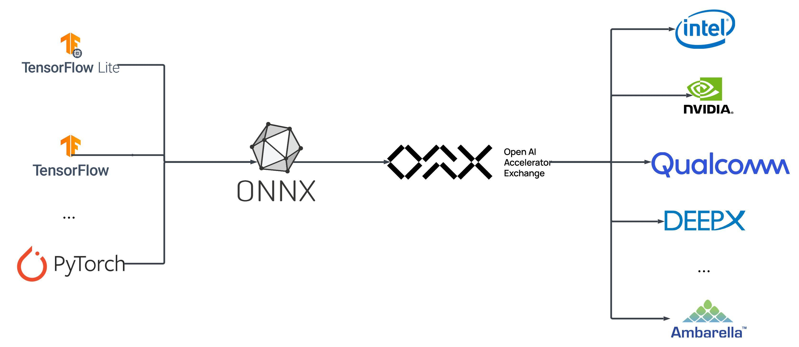

# Getting Started with OAAX

OAAX (Open AI Accelerator eXchange) is a standard designed to facilitate the deployment of AI models across various hardware accelerators, such as GPUs, TPUs, and specialized AI chips, as depicted in the image below:

OAAX achieves this by providing a unified conversion and runtime interface, enabling developers to convert ONNX models into hardware-specific formats and run them seamlessly across different platforms using a standardized API.

## Terminology

Before delving into the OAAX standard, it's important to understand some key terms that are frequently used:

- **OAAX**: Open AI Accelerator eXchange, a standard for deploying AI models across different hardware accelerators.
- **XPU**, **AI accelerator** or **AI hardware**: Any processing unit that can execute AI models, such as GPUs, TPUs, or specialized AI accelerators.
- **Compile** or **Convert**: The process of converting an ONNX model into a format optimized for a specific XPU.
- **Runtime**: The library that provides the necessary functions to interact with the XPU.
- **Conversion Toolchain**: The software that compiles ONNX models.
- **Input/Output Tensors**: Data structures that hold the input and output data for the model.
- **Host**: The software that interacts with runtime to offload computation to the AI hardware.

## Example Workflow

Typically, a user would follow these steps to use OAAX to run an AI model on an OAAX-compliant XPU:

1. User runs the conversion toolchain on an ONNX model to generate an XPU-specific OAAX bundle.
2. Host application loads a runtime library (`libRuntimeLibrary.so`).
3. Host calls `runtime_initialization()` to initialize the runtime.
4. Host calls `runtime_model_loading("model.oaax")`.
5. Host sends inputs using `send_input(input_tensors)` and retrieves outputs using `receive_output(output_tensors_holder)` asynchronously.
6. Host destroys runtime with `runtime_destruction()`.

## Object Detection Example

To illustrate the OAAX workflow, let's consider an example of running the YOLO v11 model on an OAAX-compliant XPU: